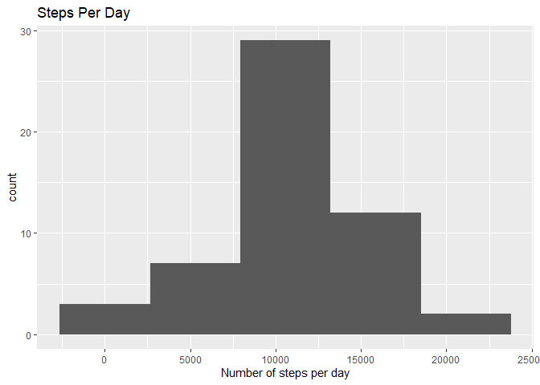
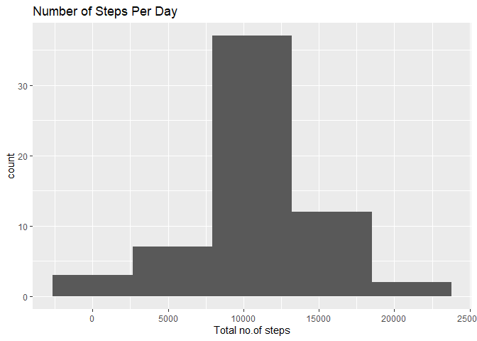
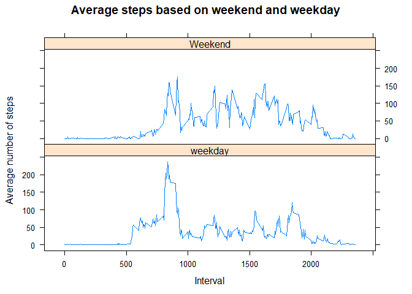

```r
knitr::opts_chunk$set(echo = TRUE)
```

Loading data

```r
unzip("activity.zip")

activity <- read.csv("activity.csv")
```

data processing

```r
Activity2 <- activity[!is.na(activity$steps),]

Activity2$DateTime <- as.POSIXct(Activity2$date, format = "%Y-%m-%d")
Activity2$day <- weekdays(as.Date(Activity2$date))
```
## Question 1

### Part 1:Calculating the total number of steps taken per day

```r
library(dplyr)
```

```
## 
## Attaching package: 'dplyr'
```

```
## The following objects are masked from 'package:stats':
## 
##     filter, lag
```

```
## The following objects are masked from 'package:base':
## 
##     intersect, setdiff, setequal, union
```

```r
stepsperDay <- Activity2%>%
  group_by(DateTime)%>%
  summarise(count = sum(steps))
```

### Part 2: Histogram showing total number of steps taken per day

```r
library(ggplot2)
ggplot(stepsperDay,aes(x = count)) +
  geom_histogram(bins = 5) +
  labs(x ="Number of steps per day", title = "Steps Per Day") 
```

<!-- -->

### Part 3:Mean and Median of the total number of steps per day

```r
mean <- mean(stepsperDay$count)
print(mean)
```

```
## [1] 10766.19
```

```r
median <- median(stepsperDay$count)
print(median)
```

```
## [1] 10765
```

## Question 2

### Part 1:Time series plot showing the Average number of steps per intervel

```r
library(ggplot2)
library(dplyr)
#calculating the average number of steps per day
IntervalTable<- Activity2 %>%
  group_by(interval) %>%
  summarise(Avg = mean(steps))

#Create line plot of average number of steps per interval
ggplot(IntervalTable, aes(x=interval, y=Avg))+
         geom_line() +
         xlab("Interval") +
         ylab("Average Number of Steps") +
         ggtitle("Average Number of Steps per Interval")
```

<!-- -->

### Part2:Maximum steps by interval

```r
maxsteps <- max(IntervalTable$Avg)


IntervalTable[IntervalTable$Avg == maxsteps,1] #interval contains the maximum average number of steps
```

```
## # A tibble: 1 x 1
##   interval
##      <int>
## 1      835
```

## Question 3

### Part 1:Total number of missing values in the dataset

```r
NAs <- sum(is.na(activity))
print(NAs)
```

```
## [1] 2304
```

### Part 2:Create the average number of steps per weekday and interval

```r
library(dplyr)
avgTable <- Activity2%>%
  group_by(interval,day)%>%
  summarise(avg = mean(steps))

#adding a day column in activity dataset
activit <- activity
activit$DateTime <- as.POSIXct(activit$date, format = "%Y-%m-%d")
activit$day <- weekdays(as.Date(activit$date))

## Create dataset with all NAs for substitution
nadata<- activit[is.na(activit$steps),]

## Merge NA data with average weekday and interval for substitution
newdata<-merge(nadata, avgTable, by=c("interval", "day"))
```

### Part 3:Reorder the new substituded data in the same format as clean data set

```r
newdata2<- newdata[,c(6,4,1,2,5)]
colnames(newdata2)<- c("steps", "date", "interval", "day", "DateTime")

#Merge the NA averages and non NA data together
mergeData <- rbind(Activity2, newdata2)
```

### Part4.1:Histogram of total number of steps taken each day

```r
mergeData1 <- mergeData%>%
  group_by(DateTime)%>%
  summarise(count =sum(steps))
  
ggplot(mergeData1,aes(x = count)) +
  geom_histogram(bins = 5) +
  labs(x = "Total no.of steps",
       title = "Number of Steps Per Day")
```

<!-- -->

### Part 4.2:Calculating mean and median of total number of steps taken per day after imputation.

```r
mean <- mean(mergeData1$count)
print(mean)
```

```
## [1] 10821.21
```

```r
median <- median(mergeData1$count)
print(median)
```

```
## [1] 11015
```
These values differ from the estimates from the first part of the assignment

## Question 4

### Part 1:Create a new factor variable in the dataset with two levels 
-“weekday” and “weekend” indicating whether a given date is a weekday or weekend day.


```r
#Create new category based on the days of the week
mergeData$dayofWeek <- ifelse(mergeData$day %in% c("Saturday","Sunday"),"Weekend","weekday")
```


### Part 2:Making a panel plot with time series plot

```r
library(dplyr)
mergeData2 <- mergeData%>%
  group_by(interval, dayofWeek)%>%
  summarise(avg = mean(steps))
library(lattice)
xyplot(avg~interval | dayofWeek, data = mergeData2, type = "l", layout = c(1,2),
       main = "Average steps based on weekend and weekday",
       ylab = "Average number of steps",
       xlab = "Interval")
```

<!-- -->


